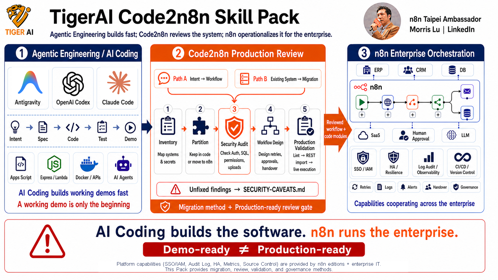

# TigerAI Code2n8n Skill Pack — User Manual

> 🌐 **English** | [繁體中文](README.zh.md)
> 📖 **Why Code2n8n?** Read the [Code2n8n manifesto](CODE2N8N.md) — why enterprises need n8n *more* in the AI-coding era, not less.

> **The Code2n8n positioning**: AI Coding (Claude Code / Codex / Antigravity) is great at *writing* code. n8n is great at making code *manageable by an enterprise*. This pack is the bridge — **describe a requirement, *or* point at an existing system** (Apps Script / Express / Lambda / Docker stack), and get a runnable n8n workflow that IT, operations, and managers can all read, audit, hand off, and govern.



> 📊 **The whole pack in one picture**: Natural-language intent *or* an existing program system → Code2n8n Skill Pack (Cookbook + 2,061 reference workflows + DSL v1.2 + **15 manifest skills** + 4 enterprise patterns) → decides what logic stays as code vs lifts into an n8n node → emits a reviewable, hand-off-able, cross-system n8n workflow.
> *by n8n Taipei Ambassador Morris Lu*

---

## 🔄 Two Code2n8n paths

This pack does more than turn sticky notes into workflows. It supports two directions:

```text
Path A: from zero
natural language / yellow sticky note
  → sticky-note-to-workflow
  → n8n workflow

Path B: port an existing system
Apps Script / Express / Lambda / Netlify Functions / Docker stack
  → code-to-workflow (inventory, dedicated security gate, partition, port, validate, version/rollback evidence)
  → code modules + n8n workflow + migration docs
```

Code2n8n **does not transliterate every line of Python or JavaScript into nodes**. It re-partitions the system: complex algorithms stay in code, while triggers, cross-system wiring, retries, human approvals, notifications, and execution history lift into a visible, manageable workflow.

> **AI Coding solves "how is the function built"; Code2n8n solves "how is the capability modularized *and audited*"; n8n solves "how the modules cooperate across the whole enterprise."**

### 🧪 Proof bar — the marquee skill is grounded in 3 real ports

| Case | Upstream → n8n | Headline number |
|---|---|---|
| [Google Workspace admin](examples/google-workspace-admin-workflow/) | 1,373-line Apps Script → 7 workflows (core + entry + setup) | Line-by-line `PROVENANCE.md` + import 7/7 |
| [LINE customer service (cloud)](examples/line-ai-customer-service/) | Netlify + Supabase → core + entry + approach-C admin | Import 6/6 |
| [LINE customer service (on-prem)](examples/line-ai-customer-service-onprem/) | Docker + Postgres + Redis + Qdrant + Ollama → 37-node brain | 5-phase V&V + ⚠️ `SECURITY-CAVEATS.md` (deliberately not deployable) |

Full evidence table further down. The bar above is what *immediately* backs the two-path claim — if any of these three case studies disappear, the claim weakens.

> 🛠️ **Responsibility boundary**: The third block of the hero diagram ("n8n Enterprise Orchestration") lists SSO / IAM / audit log / HA — **n8n Enterprise ships these out of the box**, the Pack does not reimplement them. The Pack's job is to make sure Code2n8n-produced workflows *land cleanly* on top (IAM-friendly, queue-safe, rollback-traceable). The split between Pack / n8n Enterprise / your IT, and the workflow-design rules that follow, are in [`docs/enterprise-setup.md`](docs/enterprise-setup.md).

---

## 🤖 This is an Agentic Engineering Example

> **This entire project was authored using AI Agentic IDEs (Antigravity / Claude Code) — from spec to n8n workflows, every artifact was produced through human-AI agent collaboration.**

This Skill Pack is itself a working demo of **Agentic Engineering**:

| Dimension | Traditional way | This project (Agentic) |
|---|---|---|
| **Spec writing** | Engineer types every word | Chat with AI → AI produces SDD (Spec-Driven Design) |
| **n8n workflow dev** | Drag nodes on canvas | Write a yellow sticky note → AI emits runnable JSON |
| **Skill / plugin authoring** | Read docs, copy templates | Claude Code Skills + Antigravity `.agent/workflows/` orchestration |
| **Acceptance testing** | Run cases by hand, write report | AI runs 8 scenarios → auto-emits [`tests/REPORT-3.en.md`](tests/REPORT-3.en.md) |
| **Docs / README / CHANGELOG** | Backfilled after coding | Generated alongside code |
| **Third-party license compliance** | Manual review | AI detects leaked secrets, scrubs them, generates `THIRD_PARTY_NOTICES.md` |

### Agentic footprints in this repo

- **`skills/`** — `plugin.json` registers **15 Claude Code / Antigravity skills**; each `SKILL.md` is co-authored by humans and AI
- **`.agent/workflows/`** — Antigravity-native agentic workflows (e.g. `/install-n8n-pack` one-shot installer)
- **`cookbook/`** — 8 natural-language → workflow examples showing how to "talk to" the AI
- **`spec/sticky-note-three-layer.md`** — Three-layer structure spec that forces reviewable AI output
- **`research/patterns.md`** — 7 canonical skeletons + anti-patterns mined by AI from 2,061 real workflows
- **`reference-workflows/`** — AI training corpus ([Zie619/n8n-workflows](https://github.com/Zie619/n8n-workflows), MIT, secrets scrubbed)

### Who should study this project

- Developers / PMs learning **how to use an AI agent as an engineering teammate**
- Teams who already have **Apps Script, Express, Lambda, Netlify Functions, or a Docker stack** and want to evaluate **what stays in code vs what moves into n8n**
- Teams evaluating **whether Antigravity / Claude Code can replace hand-written skills / workflows**
- Anyone curious **what real human-AI co-authored engineering output looks like**

> 💡 In other words: this isn't just "a Skill Pack for n8n" — it's also an open **case study of how AI agents build a real product**.

### 👥 You (the user) can build n8n workflows the same way

**Once you install this Skill Pack, you can author your own n8n workflows with the same agentic approach** — no node syntax to learn, no code to write:

| Tool | What you do | What the AI does |
|---|---|---|
| **Antigravity** | Open your n8n project in Antigravity, run `/install-n8n-pack`, then describe what you want in plain language | `.agent/workflows/` auto-reads your intent → emits workflow JSON → deploys via n8n API |
| **Claude Code (CLI / VS Code)** | Run `bash install.sh` (or `install.ps1`) in your working dir, then describe a new requirement *or* point at existing code | Skills auto-load → generate a workflow from scratch, or run the full Code2n8n port |
| **Any AI assistant (ChatGPT / Gemini)** | Paste an example from [`cookbook/`](cookbook/00-INDEX.en.md) as a few-shot prompt | Imitates the three-layer structure and emits a compliant workflow JSON |

**Typical interaction** (30-second mental model):

```text
You ──> AI: "Every weekday 9am, pull Shopify orders, build a daily
             report, email it to the boss; on failure post to Slack #ops"

AI ──> You: ✅ workflow.json generated (Schedule → Shopify → Code → Email + Error → Slack)
             ✅ Yellow sticky: your original requirement, preserved
             ✅ Blue sticky: which credentials, constraints, test method
             ✅ Deployed to your n8n via API, webhook URL: https://...
```

> 🎯 **The core idea**: Users don't need to memorise n8n node syntax — clear requirements are enough to get a structured, reviewable, maintainable workflow. To claim it's *production-ready* still requires credential setup, live validation, and a security audit.

If you already have code, don't rewrite it into a sticky note. Just say:

> "Use `code-to-workflow` to inventory this project, decide what stays in code vs moves to n8n; do the security audit first, then emit SDD, workflow, and validation results."

See [`02-USAGE-MODES.en.md`](02-USAGE-MODES.en.md) (three intent-driven modes) and [`03-FIRST-WORKFLOW.en.md`](03-FIRST-WORKFLOW.en.md) (15-minute hands-on); for porting existing code, go straight to [`code-to-workflow`](skills/tigerai/code-to-workflow/SKILL.md).

---

## 📖 Reading order (strongly recommended)

| # | File | Audience / Time |
|---|---|---|
| 0️⃣ | **This README.md** | Overview, start here (5 min) |
| 1️⃣ | [`01-INSTALL.en.md`](01-INSTALL.en.md) | First-time setup (10 min) |
| 2️⃣ | [`02-USAGE-MODES.en.md`](02-USAGE-MODES.en.md) | Pick your intent-driven usage style (5 min) |
| 3️⃣ | [`03-FIRST-WORKFLOW.en.md`](03-FIRST-WORKFLOW.en.md) | Hands-on: build your first workflow (15 min) |
| 4️⃣ | [`04-FAQ.en.md`](04-FAQ.en.md) | Reference when stuck |

---

## ⚡ Understand it in 90 seconds

### What it does

You drop a **yellow sticky note** on the n8n canvas and write (in any language):

```text
Every day at 9 AM, fetch sales data and email the daily report to my boss.
On failure, notify Slack #ops.
```

You ask AI to build it. The canvas now shows a complete workflow:

```
┌─ Yellow sticky: your requirement (preserved as-is)
├─ Middle: AI-generated nodes (Schedule → HTTP → Code → Email)
└─ Blue sticky: AI's notes (credentials needed, assumptions, limitations, how to test)
```

No code. No syntax to learn. No need to memorize n8n node names.

### Four usage modes

| Mode | When | Trigger phrase |
|---|---|---|
| 🪄 Cookbook copy | You know what you want, fast | Copy from [cookbook](cookbook/00-INDEX.en.md) |
| 💬 Q&A mode | You have no idea how to describe it | "enable Q&A mode" / "問答模式" |
| 🔍 Example finder | Want to see prior art first | "find examples for X" / "範例查詢" |
| 🔄 Code2n8n port | You have existing code or a system and want it governable in n8n | "Use `code-to-workflow` to analyse and port this project" |

The first three start from intent. The fourth starts from existing code. Full Code2n8n methodology: [`skills/tigerai/code-to-workflow/SKILL.md`](skills/tigerai/code-to-workflow/SKILL.md).

---

## 📂 Pack contents

```text
TigerAI-Code2n8n-Skill-Pack/
├── README.md / README.zh.md ← You are here
├── CODE2N8N.md              ← Code2n8n manifesto (positioning + thesis)
├── 01-INSTALL.md/.en.md       ← Install
├── 02-USAGE-MODES.md/.en.md   ← Three intent-driven usage modes
├── 03-FIRST-WORKFLOW.md/.en.md ← Hands-on tutorial
├── 04-FAQ.md/.en.md           ← Common questions
│
├── cookbook/                  ← 8 copy-paste recipes (each has plain-language + DSL fold)
│   └── 00-INDEX.md/.en.md
│
├── skills/                    ← 14 skill folders on disk; plugin manifest registers 15 entries
│   ├── _vendor/                  6 vendor n8n-skills (MIT)
│   └── tigerai/                  8 TigerAI execution skills
│       ├── code-to-workflow/        ← Marquee: existing code / system → n8n
│       ├── n8n-security-governance/ ← Security + version control + CI/CD + rollback gate
│       └── n8n-code-to-native/      ← Code node → native n8n nodes
│
├── spec/                      ← Technical specs (for engineers)
│   ├── sticky-note-three-layer.md
│   └── sticky-note-dsl.md
│
├── examples/google-workspace-admin-workflow/    ← 1,373-line Apps Script → n8n
├── examples/line-ai-customer-service/           ← Cloud LINE CS → n8n + admin UI
├── examples/line-ai-customer-service-onprem/    ← On-prem Docker + Qdrant RAG (NOT deployable as-is)
├── examples/tigerai-flagship/ ← 3 enterprise-grade examples (with SDD)
├── reference-workflows/       ← 2,061 public workflows (AI corpus)
├── research/                  ← Research artifacts
├── tests/                     ← Three rounds of acceptance reports
│
├── CHANGELOG.md / VERSION
├── LICENSE                    ← Pack-wide MIT license
├── install.sh / install.ps1   ← Install scripts (supports Claude Code & Antigravity)
├── .agent/workflows/          ← Antigravity-exclusive workflows (e.g., /install-n8n-pack)
└── plugin.json                ← Skill manifest
```

> ⚠️ `plugin.json` currently registers one extra maintenance skill, `install-tigerai-n8n-pack`, whose folder is not yet committed to the repository — that's why the manifest has 15 entries while the on-disk skills directory has 14. Either add the missing folder or remove the stale entry before the next release.

---

## 🎯 Suggested reading paths by role

### I'm new to n8n (never built a workflow)
1. This file → `01-INSTALL.en.md` → `03-FIRST-WORKFLOW.en.md`
2. After your first workflow runs, browse `cookbook/00-INDEX.en.md` for your scenario
3. Stuck? → `04-FAQ.en.md`

### I'm experienced with n8n, evaluating this Pack
1. This file → `02-USAGE-MODES.en.md`
2. Read `tests/REPORT-3.en.md`: historical acceptance baseline (v0.9.0 R3)
3. Browse any of the three Code2n8n case studies under [`examples/`](examples/) for current evidence
4. Browse `examples/tigerai-flagship/`: enterprise-grade SDD examples

### I'm an engineer / integrator
1. This file → `spec/sticky-note-three-layer.md` + `spec/sticky-note-dsl.md`
2. Porting existing code: `skills/tigerai/code-to-workflow/SKILL.md`
3. Security, version control, CI/CD, and rollback gate: `skills/tigerai/n8n-security-governance/SKILL.md`
4. Building from scratch intent: `skills/tigerai/sticky-note-to-workflow/SKILL.md`
5. `skills/tigerai/n8n-api-bridge/SKILL.md`: n8n REST API SOP
6. `research/patterns.md`: 7 standard skeletons + anti-patterns

### I have existing code I want to move into n8n
1. Read [`CODE2N8N.md`](CODE2N8N.md) first to understand the "keep in code / lift to flow" split
2. Use [`code-to-workflow`](skills/tigerai/code-to-workflow/SKILL.md) for source inventory, partitioning, and **Step 1.5 security audit**
3. Compare against the three empirical case studies: Google Workspace admin, LINE cloud, LINE on-prem
4. Pass static lint + n8n REST import, then end-to-end with real credentials
5. If security findings remain unfixed, per marquee skill hard rule §3, publish a `SECURITY-CAVEATS.md` — see the on-prem LINE CS example for the template

### I'm distributing this to my team
1. This file → run `01-INSTALL.en.md` end-to-end
2. Read `04-FAQ.en.md` to prepare for team questions
3. Hand the entire folder to teammates and ask them to start at this README

---

## ✨ The three-layer structure (one diagram)

```text
┌─────────────────────────────────────────────────────┐
│ 🟡 Layer 1 (yellow sticky): User intent              │
│    "Every day at 9 AM..."                            │
│    ← AI never modifies this. Always the source of    │
│      truth.                                          │
├─────────────────────────────────────────────────────┤
│    Layer 2: AI-generated nodes & connections        │
│    Schedule → HTTP → Code → Email                   │
├─────────────────────────────────────────────────────┤
│ 🔵 Layer 3 (blue sticky): AI's commentary            │
│    • Why each node was chosen                        │
│    • Required credentials                            │
│    • Assumptions and known limits                    │
│    • How to test                                     │
└─────────────────────────────────────────────────────┘
```

---

## 🛠️ Pain points this Pack solves

| Pain | Solution |
|---|---|
| AI-written workflows are inconsistent, hard to review | Enforce three-layer structure |
| Users don't know how to describe what they want | Plain-language stickies + 8 cookbooks + Q&A mode |
| AI doesn't know n8n well enough | 6 vendor official Skills + 2,061 workflow corpus |
| Don't know what existing code to keep vs move into n8n | `code-to-workflow` 7-step methodology + 3 empirical case studies |
| AI-written code demos fine but auth / SQL / secret management may not ship | Mandatory **Step 1.5 security audit**; unresolved findings disclosed via `SECURITY-CAVEATS.md` |
| No enterprise-grade patterns | 4 pillars: Atomic Orchestration / Universal Worker / SDD / Security |
| Don't know where to start | `03-FIRST-WORKFLOW.en.md` 15-min hands-on |

---

## 🧪 Code2n8n empirical case studies

| Case | Code2n8n path | Evidence |
|---|---|---|
| [Google Workspace admin workflow](examples/google-workspace-admin-workflow/) | 1,373-line Apps Script → core + entry n8n workflows | Line-by-line `PROVENANCE.md`; static lint 0 err / 0 warn; n8n REST import 7/7 |
| [LINE AI customer service (cloud)](examples/line-ai-customer-service/) | Netlify Functions + Supabase → n8n runtime + approach-C admin UI | Static lint 0 err / 0 warn; n8n REST import 6/6 |
| [LINE AI customer service (on-prem)](examples/line-ai-customer-service-onprem/) | Docker + Postgres + Redis + Qdrant + Ollama + n8n | 37-node workflow; 5-phase V&V; security audit disclosed major defects — **DO NOT DEPLOY AS-IS** |

The third case deliberately preserves the upstream POC's security defects and documents them in [`SECURITY-CAVEATS.md`](examples/line-ai-customer-service-onprem/SECURITY-CAVEATS.md). This isn't "failed acceptance swept under the rug" — it's Code2n8n's core principle: **AI-written software that runs is not automatically software an enterprise can deploy.**

---

## 📊 Historical baseline acceptance (v0.9.0 R3)

The numbers below were the real-environment baseline for three-layer workflow generation as of **v0.9.0 R3**; the current pack version is **v0.22.2**, and the three Code2n8n case studies above are the v0.22.x evidence layer that supersedes pure-generation acceptance.

| Layer | Pass rate |
|---|---|
| JSON parse | 8/8 (100%) |
| n8n CLI Import | 8/8 (100%) |
| API Activate | 7/8 (87.5%) — T3 blocked by real Telegram bot token check |
| Webhook routing | 4/4 (100%) |
| Full execute success | 2/4 (with `continueOnFail` design) |

Details: [`tests/REPORT-3.en.md`](tests/REPORT-3.en.md).

---

## 🔢 Version & changelog

Current version: see [`VERSION`](VERSION). All changes: [`CHANGELOG.md`](CHANGELOG.md).

---

## 📜 License

**The whole pack is now MIT-licensed.** See the root [`LICENSE`](LICENSE) file.

- `skills/_vendor/`: MIT — from [czlonkowski/n8n-skills](https://github.com/czlonkowski/n8n-skills), see `skills/_vendor/LICENSE`
- `reference-workflows/`: MIT — from [Zie619/n8n-workflows](https://github.com/Zie619/n8n-workflows). API tokens, bearer tokens, and other secrets present in the original files have been replaced with placeholders (e.g. `YOUR_API_TOKEN_HERE`) before redistribution.
- `examples/line-ai-customer-service-onprem/`: derived from MIT-licensed `scorpioliu0953/ai_customer_service`, attribution chain in the example's `CREDITS.md`.
- The rest (TigerAI-authored skills, cookbook, specs, docs, install scripts, manifesto, marquee `code-to-workflow` skill): **MIT** (Copyright (c) 2026 Morris Lu / TigerAI).

Full third-party notices: [`THIRD_PARTY_NOTICES.md`](THIRD_PARTY_NOTICES.md).

---

## 🆘 Stuck?

Tell Claude / ChatGPT:

> "I'm new to this. Following the TigerAI Skill Pack README, currently on [filename], hit [problem]."

The AI will diagnose. Or check [`04-FAQ.en.md`](04-FAQ.en.md) first.
