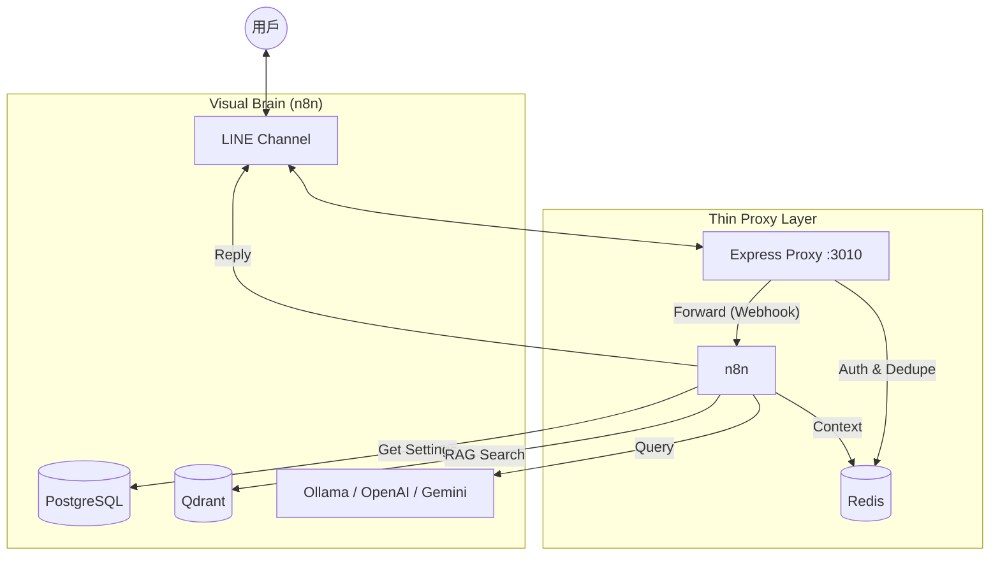

# 📝 系統設計文件 (SDD) - AI Customer Service (n8n Integration)

## 1. 系統概述
本系統旨在提供一個可視化、易於維護的 AI 客服機器人。透過 Express.js 作為 Webhook Proxy 轉發 LINE 訊息至 n8n 工作流，實現「開發者用程式控管連接，管理員用節點控管邏輯」的混合架構。

## 2. 核心架構圖

## 3. 關鍵技術堆疊
- **後端**: Node.js/Express (ESM / TypeScript)
- **視覺化引擎**: n8n
- **資料庫**: PostgreSQL (Persistent Settings)
- **快取/去重**: Redis
- **向量資料庫**: Qdrant (Knowledge Base)
- **地端 AI**: Ollama (Llama3)

## 4. Webhook 處理流程
1.  **驗證**: Express 接收到 LINE Webhook，驗證簽名。
2.  **分流**: 檢查資料庫 `use_n8n` 旗標：
    *   `true`: 將 Payload 轉發至 n8n Webhook URL。
    *   `false`: 執行本地處理邏輯。
3.  **n8n 去重**: 利用 Redis 的 `eventId` 作為唯一 Key 進行去重攔截。
4.  **RAG 檢索**: 提取用戶訊息，於 Qdrant 執行相似度搜尋。
5.  **AI 回應**: 結合 `System Prompt`、`Context` 與檢索結果，由 AI Agent 產出回覆。
6.  **回傳**: 透過 LINE Reply API 直接回應給用戶。

## 5. 資料結構 (Postgres)
- `settings`: 儲存 LINE Token、AI 配置、n8n Webhook URL。
- `user_states`: 追蹤用戶當前的對話模式（AI/真人）。

## 6. 安全性思考
- 所有對外部服務的連線均在 `tigerai-net` 私有網路內執行。
- 資料庫連線使用非 root 帳戶，確保權限受限。
- Redis 設有自動過期時間 (TTL)，防止記憶體無限增長。
